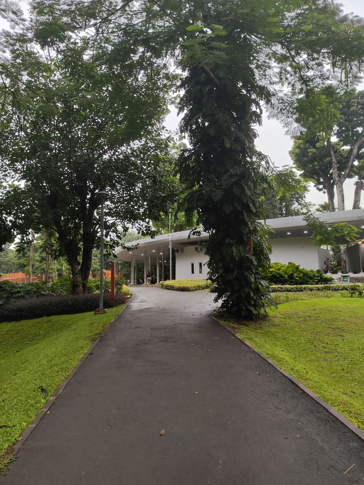

# Hello again and I am back

I am back from my hiatus. So sorry for my absence due to my thesis and stuff. Now, I already passed the defense and already completed my graduation stuff. Can we continue now?

## 12:11
### Waiting

So, I already planned for lots of places to visit. However, I realized something that every Saturday, there would be a rain on morning. So, I had to wait inside my apartment until...

## 13:00
### Letsa go!

It is too late now and consider my route will have dubious amount of traffic, I can only go to certain places. This time, I have a short itinerary, starting with the biggest Gramedia (bookstore brand) in Indonesia, which is located in Matraman. Then, I will eat at middle-eastern restaurant nearby. I will end it off with a quick walk inside Tebet Eco Park.

All set? Ok off we go

As usual, I will set my foot from Tanjung Duren BRT Station. You can read a bit about the bus system in Jakarta on my `Transjakarta` page.

<Transportation id="bus-1" />

## 14:14
### Gramedia? hmmm? Meh?

Ok I have a great expectation from this Gramedia bookstore.
After arriving and taking pictures of how crowded the highway was, I got out from the flyover and then entered the bookstore. First impression was... meh

<Video src="https://www.youtube.com/embed/d4ExXpj9d6k" controls title="Inside Gramedia Matraman hehe"></Video>

The only thing that stands out is the wide spaces to walk and so much products offered. The rest is just mid. I don't expect anything more from bookstore though so yeah. I bought a plastic wrapper for my another useless project (Notaphily) and a piece of small cutter to seal off my money.

You might realized that I never mention anything about food as of now. Well, that's because I hadn't had anything yet to fill my hunger bar. So, let's just do that or else my stomach will act naughty again hehe.

## 14:47
### I might order too much hehe

So I went to this restaurant that I accidentally saw on Google Maps while scouring area from Gramedia. I went to the place and let's just say that this restaurant was my lucky place.

First things first, I love the interior. It gave me a blend of middle-eastern restaurant. I have no odea what real middle eastern restaurant looks like but I guess it is authentic enough hehe?

The restaurant offers three kinds of seats. The first one is the VIP room which is perfect for private dining with a minimum order of 1.5M IDR. The room is separated from the main dining area. The second one is the floor room. It is connected to the main dining area and can hold 6-12 people. The third one is the chair and table sets if you prefer to sit on a chair instead.

Fo context, they offer 3 kinds of seats, VIP room, floor room, and chairs. For floors, they offer 6-12 people for one room and VIP (VIP needs 1.5M minimum order tho). For chairs, they can fit 4-10 people depending on your seat.

The waitresses was so kind and helpful. They were more than happy to answer my question about the restaurant. If I did not ask them enough, I might miss my chance about knowing their Ramadan Buffet offering. So, from 5th to 25th day of Ramadan, you can reserve their seat for Ramadan buffett for 250K IDR per pax. Isn't that great? Of course I will reserve and come back.

Also the toilet... was surprisingly clean. It even beats the average shopping mall's toilet. It was fragrant and no water puddle spotted, even inside the toilet.

The menu was a bit mess. Well, at least they provide a good picture of their food. So many foreign words and specialty. While Google still exists, I could not avoid myself asking the waitress. What's funny was that the waitresses are kinda confused about the menu when explaining to me. This is my real concern with this restaurant. Menu needs to be revamped with more description.

Enough Neuron as Restaurant Critique. I am starving! Now, let us jump to their specialty. Just a reminder that due to some reasons, **I am unable to eat lamb**.

Sauce was provided for free. I love the green one the most because it was able to kick my tongue and did not leave a lasting effect of spiciness. Definitely recommended!

First things first, we had Mandi Rice (some kind of spiced rice) with Madhabi Chicken (grilled chicken with spices). It was scrumptious. The grilled chicken was perfect although did not have much meat to dig in. It was very smoky and light. The rice also so light, fragrant, and great texture (a bit hard because i love hard rice hehe).

We had chicken kebab with french fries. It was also enjoyable. The meat was a bit dry but still ok. The veggies were refreshing, the bread although a bit tough, still chewable and light.

Last, we had Fasolia (white beans simmered with tomato soup, arabic herbs, and cheese). This is oddly familiar with curry that I had on 27th of January, yet I had no need to complain about this one. Great food. It came alongside this Sultan-sized Khubz (Roti or Chapati etc whatever you called it).

One thing that I need to tell you is how BEEG their portion was. I ordered 3 types of food because I was thinking that the quantity of the food would be as much as a fancy restaurant serves. Turns out that was a dangerous mistake. For the first time ever, I requested a takeaway for the Fasolia. I really could not stuff much more at that time. I was f-in full.

Overall, this was a great lunch-dinner experience for me. It was worth it and definitely worth another visit.

<FoodReview id="hadrami_house"/>

## 15:33
### Ok I am stuffed. It is time to burn the calories

Thank you for the food. I was so stuffed.

Now, to burn the calories, I took a bus to my next destination, and oh boy look how advanced our civilization was.

There was a bus station near the restaurant so I hop onto the bus and the trip was so long. Just look at this graph.

<Transportation id="bus-2" />

Yeah, and I still need to walk for about 10 minutes to reach the destination. Basically after you reach Tebet Eco Park bus stop, take yourself near this JAPFA office.

After that, take a right turn and keep going until you can see this building

Turn left and keep going along and then you have reached your destination. Oh, and take 3 minutes of your life to find the nearest entrance because that was how much I spent to find an entrance.

Here is a montage of my travel here. Pretty neat park I can say although I could not do much here considering how little activity I could do. Pretty cool place to jog.

<Video src="https://www.youtube.com/embed/25vBOuecIfU" controls title="A montage"></Video>

<FoodReview id="tea"/>

## 17:12
### That was fun. Time to suffer through traffic of armored civilian vehicle.

The trip was so fun. On my way home I decided to take the previous route. However, instead of turning right (going back to Tebet Eco Park station again), I went the other way towards Cikoko station. It took 15 minutes of walking until I can reach the station.

This station was well integrated with LRT Jabodebek (Don't worry. I will make a separate article about this), train station, and bus station. It was not that croweded. I guess because it was Saturday hehe.

All was good until I found this.

Holy lord. If you guys thought that elevator was not a serious issue, think again. The only way you can get into the actual bus station is my either elevator or a narrow stairs that will freak out claustrophobe should this station is cramped on rush hour.
Transjakarta is striving to deliver transit onto disabled people and what do we have here? I hope this will be fixed soon. I beg you guys. Please do spend your bodget towards maintenance instead of revitalizing another station. That revitalization project can wait you know?

<Transportation id="bus-3" />

Ok enough the blabbering. I went home the usual way and that wraps up my short trip. I hope you enjoy and see ya on the next trip hehe.