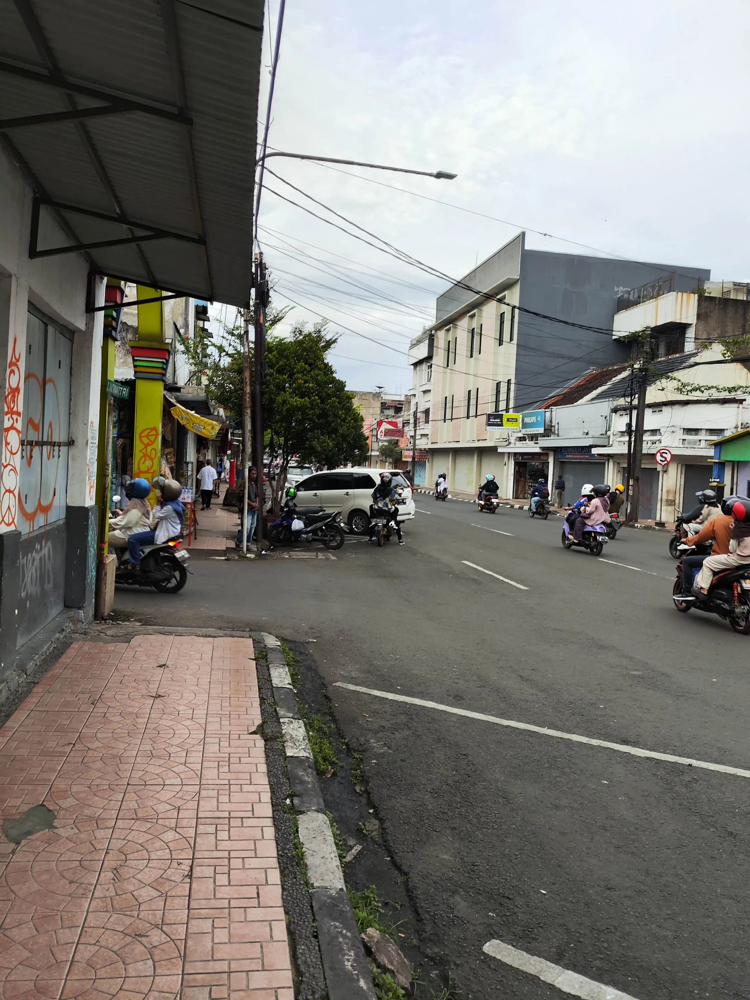
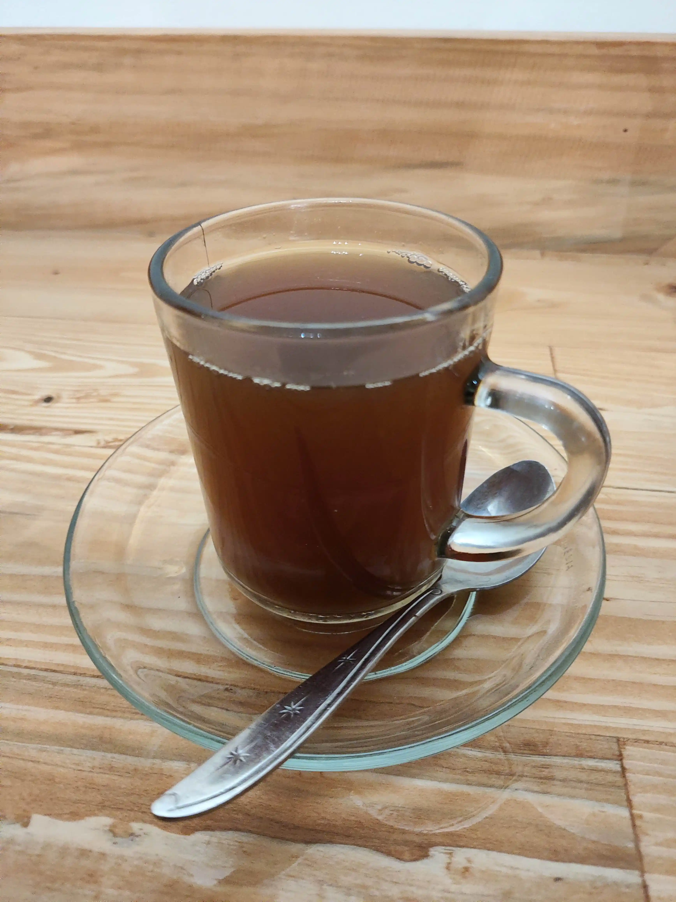
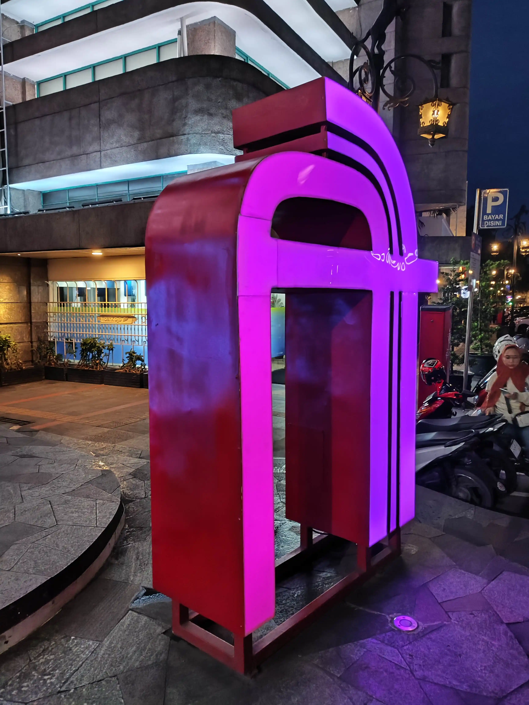

# Halo Halo Bandung Day 1 👋

Hello, internet and transit bois and gurls!
First, congratulations to my Muslim friends for finally reaching the last day of Ramadan. Any good deeds that you guys did will contribute to the entire society hehe.
Be happy and prepare yourself for Eid Al-Fitr :).

Fun fact, Indonesia is a Muslim-Majority country with the 2nd largest Muslim pops in the world (the 1st spot was taken recently by Pakistan), so Eid Al-Fitr is a huge deal. I get an entire week of holiday from my workplace. Sure, I can still go to places yet to be visited by me inside Jakarta. However, in this case, I decided to go a bit far from Jakarta.

There were multiple considerations until I landed on this decision, which is:

1. I never hop into their new and shiny public transportation system. It is called Whoosh or Bandung-Jakarta High-Speed Rail. This train shortens the trip from Jakarta to Bandung and vice versa from 2 hours and 30 minutes into a measly 30 minutes of ride (if you don't account for their feeder train).
2. I never stepped foot onto Lembang, their touristy highland region.
3. I want to try and review their transportation system, especially their traditional microbuses.
4. Why not? I have an entire week of holiday. I would not waste my holiday just to travel inside Jakarta only lol.

Well, those are very legitimate justifications for my travel, right? I have one more justification. I want to see if I can survive inside Bandung with no Uber or equivalent. I also want to see if I can survive alone since I only travel solo.

Great, I would go to Bandung for 3 days. Without further ado, I bought a round-trip High-Speed Rail for 300K each trip and booked my hotel for 2 nights for 340K per night.

Well, that was already 1280K IDR spent. It was a lot I can say. Remember the sayings. Money can come later, but time and experience might not come soon.

After the purchase, I kinda slacked off and packed my things on D-1 of my trip.

## 06:00

### April 9th. Good Morning ☀️

Morning. My trip was scheduled at 9:47 AM and waking up at 6 AM was a great decision. After preparing my drinking water and checking up on things, I locked up my apartment door, marking the start of a long-range solo journey.

I did not bring anything fancy. Just a backpack for my umbrella and drinking water, a handbag, and luggage with my clothing and amenities inside.

I already vowed to not use any Uber service so I would go using only public transportation or using my feet.

The high-speed train is stationed at Halim station, which is integrated with LRT Jabodebek, which is also integrated with Transjakarta. I already surveyed the route a day before. At first, I would try to transit into their LRT station at Dukuh Atas. After much more careful planning and research, here is what I come up with:

<Transportation id="bus-1"/>

<Transportation id="lrt-1"/>

## 08:20

### Better be too early than be too late

Why? Something unexpected might happen. There might be unexpected closed lines or technical difficulties. Remember, rail-based transportation systems are mostly strict with their timetables. A minute late means a ticket is wasted. Yet, I admit that I was too pessimistic about the travel, but I digress

So, I am here, inside the train station. Saying that this is an average train station is underwhelming. It proudly resembles an airport with a high ceiling, wide corridor, sleek and futuristic design, and modern boarding pass system that can be either printed or not.

I didn't have any food for my breakfast, so I bought a snack from nearby Auntie Anne and a coffee drink. It was from a well-known franchise so I knew it would be good.

<FoodReview id="auntie_anne"/>
<FoodReview id="kopi_kenangan"/>

After wasting my time by eating and charging my phone while scrolling through my feeds, The gate finally opens for my schedule. I printed my ticket so I could keep it as memorabilia. The checking was convenient. The gate will do the checking automatically. Either insert your physical ticket or scan the QR code from your application.

## 09:30

### I am in!

After climbing the staircase, there it is. The first high-speed train I had seen in my life. The design is sleek and futuristic. The train uses the OVH system to supply its power. I will make a separate article about this train, so I am not going to detail every single aspect of this train hehe.

Now I am here, here is the interior for the cheapest class. Feels like a business class I can say.

## 09:47

### It is moving. Now for the fast 30mins ride to Bandung. Let's go!

The train is moving fast. So sad that it did not reach its top speed (350 km/h), yet at least it reached a velocity closer to that number. It did not stay at its top speed for long since the train slowed down gradually until it reached its destination.

<Video src="https://youtu.be/sN_1IyxYJ7Y" start="4" end="214"></Video>

## 10:17

### Welcome to Padalarang, Bandung

Hello Padalarang!
I was one step closer to Bandung. Since there is no direct route to Bandung station, I need to take their feeder train that will take me to Bandung station. This train is already included in my ticket so no additional charge is necessary.

## 10:52

### Halo-halo Bandung, for real

I am officially far enough from my residence. The first experience is... oh sheet I cannot describe it. It feels like I have absolute freedom, yet a bit afraid. I don't have anyone to rely on besides myself. It's like my only goal was to survive and enjoy for the next 2 days.

I was very paranoid about my belongings after stepping foot in Bandung. I always double-guard my bags and even bring 2 phones in case one gets snapped out of my hand. If I don't have my phone, I am pretty much done in Bandung.

...

## 11:00

### I want my brunch hehe

I haven't had my lunch. Luckily, I knew the exact place I needed to go. Not far from Bandung Station, there is a well-known burger stand that always gets crowded no matter what day it is.

It takes approximately 10 minutes of walking. You can use Google Maps and search for "BBQ Mountain Boys Burger" and it will take you to one exact place.

Be wary that the queue might be a nightmare. This is my 3rd visit and my last visit was much worse as I needed to wait for an hour just to get a chance to order.

Oh, I only need to wait for 10 minutes. That's a relief hehe. I guess this is a great start for my trip. And, I can quickly find an empty indoor seat. The last 2 trips told me that this is not something common.

I ordered their signature Classic Double Burger with Extra Bacon and 6 pcs of Garlic Parmesan Chicken Wings.
When I took out my order, oh lord that was a heck ton of wings. When the menu says chicken wings, it means a full wing. I should order 3 pcs instead 🙃.

Now for the burger. It was so juicy and tender. The bread might be soggy, so you had to eat it fast. Bacon was smoky and juicy. I have no words to say.
Wings. It is also so tender that I can peel off the bones quickly, leaving only the meat that I can quickly savor.

You should try it yourself. It is a gem inside Bandung. If I had any chance to visit this place again, I could gamble that this place would be my very first destination after getting out of Bandung Station. This might be the only place where it deserves a full score from me.

<FoodReview id="bbmb"/>

## 12:34

### Let's take a walk around, shall we?

I finally get large amounts of carbs that I need to burn. To burn some carbs down, I take a walk around the complex. This is Paskal Hyper Square. There is a 23 Paskal Mall at the center of the complex. There is also a university integrated with the mall. Here is some montage that I already captured. I compiled the pic in a single video due to the amount of pictures I had taken.

After a quick walk, I walk neat Kebonjati Hospital for a bus. I will make a separate blog about Trans Metro Bandung, but for now, what you need to know is that they are a non-BRT bus with only one tapping necessary.

You just wait for the number 4 bus. Then, tap your prepaid cards and you are set to go hehe.

My hotel is located at the heart of Bandung, so it is in a very strategic position. I can visit Alun-Alun Bandung as many times as I want, but that's not my primary reason to be here. I have a much bigger agenda.

Too bad I did not take any pictures of my hotel, but if you are interested, search for "Bobopod Bandung" and you will get the result. I can say that it is a low-price stay but with competitive quality. They know how to maintain their place. The toilet and shared bathroom were cleaned properly and regularly. The bedroom is comfortable with adjustable light color and brightness although might trigger claustrophobia for some of you. The only thing that needs a major checkup is their charging port. It is very hard to plug my charger and even after successfully plugging in, I still need to move the brick randomly till it starts charging.

## 17:00

### After an hour of slacking inside my room...

You know, getting off the bed is the hardest thing to do once you lay off your entire body and soul wkwk... Alrighty, I already spend 1200K for this trip so I cannot fill this day with just slacking

First, I just walk randomly to find a milk drink stall that might still be open. As I walk around, I recognize that Bandung is just a grid-like city. Everywhere I go there is a great chance that I will find a four-lane intersection. Although this might ease my traveling effort, the moment I want to cross the road is just a lot of hassle since there isn't much of a traffic light.

After looking around while admiring the empty complex, I arrived at this milk drink stall. I can drink glasses of milk if the store is not closed. Too bad :(

So I have to find another drinking stall. Any stall, cafe, or shop will do and just meters away, there is still a cafe that is still open for business.

It is a humble cafe with a traditional Javanese theme with ginger as their signature ingredient. With that in mind, I order 2 cups of drinks.
The first drink is Teh Tarik. Tastes like a powdered drink. Knowing the brand instantly, I will give this a pass but without mentioning the inflated price. The second one is Teh Jahe. I like the warmth it gives to my tongue, my esophagus, and my stomach. Sure, it is just a regular tea with ginger, yet just refreshing for me before my next destination.

Also please place my order closer to me since I already waited for 10 minutes for my drink only to realize that the drink was already served beside the next chair XD.

<FoodReview id="djahe"/>

## 17:45

### More footage from my short walk

Firstly, I need to apologize for my lack of photos or videos since this is my very first trip out of my residence city and I have trust issues with everyone around me since I am scared that someone just robbed my phone. It will spell the end of my life as a whole.

With that in mind, enjoy this short compilation I take while visiting Braga Street and the Asian-African area.

Oh, not to mention I bought some snacks for my little sister in Jakarta. I also brought this little dessert for myself. The place is called Tiramisusu by Chocomory, a prominent dairy brand known across Java island.
The dessert is enjoyable from my tastebud's testimony. The tiramisu is not too sweet with some bitterness from the mocha ice cream. It might be a bit pricey for a small portion, but if you are craving a dessert before Eid Al-Fitr, try this out once in your life.

<FoodReview id="tiramisusu"/>

And, for my final food for this day, I ordered their traditional Mie Kocok inside Food Court Alun-Alun Bandung. Not sure if this is the authentic Mie Kocok. The beef was... uncanny to say at least. Some of the parts don't look appealing to me 🙃. In the end, I only managed to eat the noodles and the broth. I cannot remember the exact price, but it might be around 22K. Not worth the price honestly.

<FoodReview id="mie"/>

Well... After my final dish for the day, I took a small walk around Alun-Alun Bandung. It was so chill. Usually, on the last day of Ramadan, there would be a massive parade chanting Takbir around the street. I guess the presence of police and the fact that it would not make the drivers happy made the street chill enough.

## Fin

I looked around and took some pictures. Some places had their stalls closed because of the police.

I did not expect this level of chill considering this was the last day of Ramadan.

All I can say is... Congratulations on your full month of Ramadan my Muslim friends. May your prayers and acts of kindness maybe be accepted by Allah and the people around you. Tomorrow is your victory day. Tomorrow is Eid Al-Fitr. Cherish with your family or take a break from the 11 months of hardship you have endured as you deserve one.
