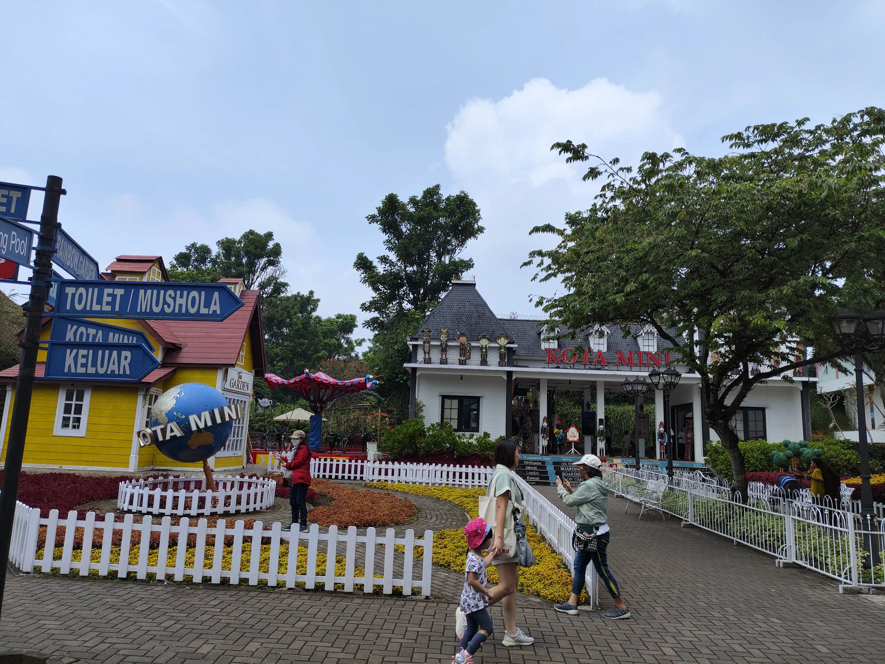
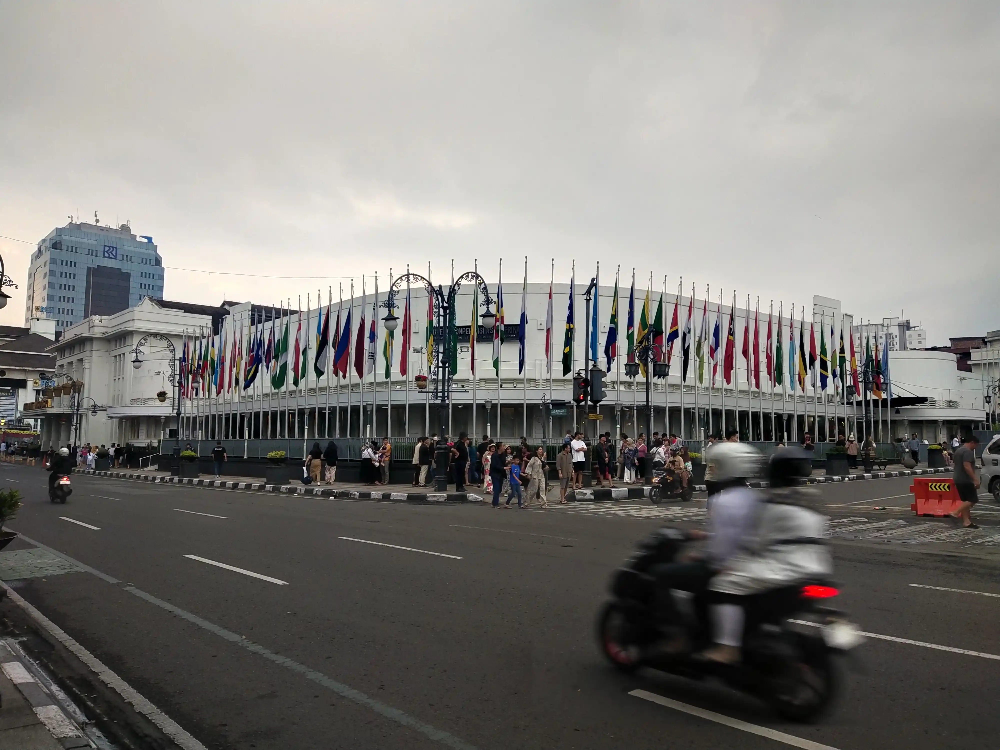

# Halo Halo Bandung Day 2 👋

Happy Eid Al Fitr
May you always be blessed with goodness gracious for all of us. Be happy and love your family. Plus, be happy hehe.
This is a continuation of my travel yesterday April 9th, 2024.

## 08:30

### Morning ☀

Ok, I wake up and shower inside my pod room and I prepare myself. For breakfast, they gave me a bowl of cereal and milk. Being a normal person, I pour my cereal before pouring my milk and anyone who fumes in rage with this fact shall make an appointment with a mental psychiatrist lol

Let's go to the itinerary. I planned to go to The Lodge Maribaya and another place should I have another time.

After having breakfast which was just cereal and milk, I went outside of the hotel. Since no bus will take me there, I will try something new by using their micro-buses.
I saw that there was a line that would take me to Ledeng terminal where I could transit onto another microbus that would take me to Lembang
After walking for 10 minutes, I asked the driver passing by for a direction. Surprise surprise, that line was not available for the duration of Eid Al-Fitr, so I need to transit 2 times which are at Paskal and Ledeng
This trip costs me about 20K and takes me approx 2 hours, but is it worth it? Definitely. There are no Gojek or equivalent due to traffic and holidays and even if there are some, it will cost me like 60K.

You should know that they only accept cash. Make sure to bring one. I should note that the fares are arbitrary. Meaning you should not give them too much money. Try to ask the other passenger how much they paid for their trip on usual occasions.

<Transportation id="bus-1"/>
<Transportation id="bus-2"/>
<Transportation id="bus-3"/>

## 09:20

### Welcome to Lembang. The first time I stepped my foot in here

I docked myself at Alun-alun Lembang. The first thing that I noticed was the air. It was cool. Not a chilling cold, but a comfy cold. A good break for my skin after the hot air in the inner city of Bandung.

The square is pretty deserted with only a family or two taking a picnic here. I guess people are still in interview sessions with their families hehe.

It looks like a great place for chilling out thinking about life with the relaxing wind and so many places to take a seat. Take a look hehe

After that, I don't have an idea what should I do next. The Lodge would open for business in 10 AM. I need to visit a place to spend my 40 minutes. After a quick chat with my sister, who has a great knowledge of Bandung, I took a step to Rumah Sosis (Sausage House). The distance from Alun-alun Lembang is not that far from my standard.

On my way to my destination, I stopped myself at this stall that sells Ketan Bakar. It is a local snack made with a grilled block of glutinous rice accompanied by two sauces (I assumed this is chili and peanut sauce) and Serundeng (grated and sauteed coconut). It is so delicious if paired with all of the sauces. Worth trying.

<FoodReview id="ketan_bakar"/>

...

And here I am 😊
Basically, this Rumah Sosis is just a place where they sell food souvenir and their authentic sausage. I am much more interested in their market where they sell various things from foods, drinks, and clothing.

I bought some of their specialties here because I was ravenous. It was crowded considering it is a must-go for Lembang visitors. The payment system is unified in one counter. You order in one stall for your food, then they will give you a receipt so you can queue and pay at a specific place for payment, and return and claim your goods.

I bought 3 different kinds of grilled sausage and a glass of plain cold milk. I did not take a picture of the rest 2 grilled sausages unfortunately because I bought it at a separate time 😭.

The milk was plain and refreshing. Perfect for an incoming sunlight avalanche later. Of all three flavors of sausages (original, black pepper, and cheese), I would prefer the original. So savory and thick 🥺. If it wasn't a hassle to bring it home, I would use it for my fried rice topping.

<FoodReview id="susu_lembang"/>
<FoodReview id="rumah_sosis"/>

## 10:18

### Told ya before about going to The Lodge Maribaya. About that...

I cannot find any Uber driver to take me there. Yup, there is no public transportation that can take me closer.

Well, I still have 4 hours to spend here.
I remember something from my sister. There is a place to visit that takes the floating market as its main theme. It is called "Floating Market Lembang" (duh). The distance from my current coordinate is not that far (at least from my eyes).

So, I set off from Rumah Sosis, took a turn, walked past the scorching hot sun, and here it is. I arrived at the entrance. The entrance road isn't paved and there are a lot of cars lining up to get a parking spot. Another reason to not bring your car to Lembang aside from the frequent congestion.

Passing the gate, I went straight to the ticket station. I did not remember each of the plans they offered. I went ahead and bought their complete bundle for 60K IDR. It already includes an entrance to the floating market and Kota Mini (mini-town).

After that, I took a walk again for a minute or two and the main gate was ahead. Just tap your ticket and I am inside. Inside, there is also a gate for Kota Mini.

As explained before, I did not take many pictures due to safety concerns, but I want to say that if you went solo, Kota Mini might not be your best choice. It is best enjoyed by a family with kids or a group of friends that can take 3 pictures per minute.
I belong to neither of the mentioned group, so I entered and I left the region 20 minutes after.

## 10:50

### Kota Mini. A big no from me. Next: The actual floating market

I need to tell you that the next area isn't filled with 100% floating markets. There are dozens of things you can do here and I will show you 😀

First, there is this slide that costs 35K IDR for a ride. The height is astonishing and the adrenaline when sliding down with only a tire is unforgettable, especially since your feet might hit the separator between lanes.

Not far from the slide, there is a good photo spot.

Not far from the slide, there is a good photo spot.

Then, a great orchard for a photo shoot for couples.

Oh, there is also a kart racing arena that costs 60K IDR for 10 minutes as far as I can remember (I ended up not paying for a ride).

Do not forget to take a picture in front of these coins below. These are the legal tender for the actual floating market.

I finally got onto the floating market and to my disappointment, the prices were racked up. A plate of Siomay costs 15 to 20K IDR. A bowl of Bakso costs 25 - 30K IDR. I have nothing good to say, yet it did not deter the visitors who were filling up this place.

Alas, I bought a 20K IDR coin for 22K IDR (taxes) and bought myself a coconut. The drink was perfectly sweet with delicate coconut meat. This thing doesn't need any kind of review since it is made by nature lol.

## 12:10

### The skies were going dark. Time to go back

And I need to thank myself. A minute late and I would have to wait for a ride under an intense rain. After I took an exit from the park, drops of water fell onto my hair. It wasn't long after I found a micro-bus when the density of the rain increased rapidly.

The rain got lighter when I arrived at Terminal Ledeng. That was a relief. I took another micro-bus and stopped myself at Gedung Sate, a prominent landmark not just for Bandung, but for the entire province of West Java.

<Transportation id="bus-4"/>
<Transportation id="bus-5"/>

Also, around this place, There were food stalls that sold great local culinaries. I bought a 10K plate of Siomay. A great food. My bad I did not take a picture of it. I also bought 15K worth of Bakso Malang (Bakso with additional sides). Both were great and tasty. So much so that I just realized that I already spent my entire bill.

Ah sh-t, I need to find an ATM quickly. While scouring around this large promenade, I took this picture of a monument dedicated to 200+ medical workers who sacrificed themselves for Indonesia during the 2020 pandemic. Great respect for the names engraved on this monument.

Finally, I can pull out a new cash after 30 minutes of walking.
From this point, I don't have much to say besides taking a walk for an hour with no concrete destination. I will just give you the road that I took.

## 16:50

### The skies were going dark. Time to go back

And after the exhaustion, I went back to my hotel with another micro-bus while taking some great pictures.

<Transportation id="bus-6"/>

At this point, I was pretty much done traveling across Bandung if you can call that hehe.

After dropping myself off, I went to Kings Mall because I thought I could still walk for a kilometer maybe? I never explored every floor of this mall before. Let's just say that this mall is pretty comfy yet pretty small compared to average Jakarta malls.

I still cannot remind myself to take a picture here, hey but at least I took one for this dish.

This is a curry dish I bought from one of the food court stalls here. It was claimed to be Malaysian Curry. For Malaysians who are still reading this, feel free to verify.
The dish costs 50K, so not necessarily expensive but not something you can savor every day. The rice was well-cooked with curry that was not too heavy. There were 2 types of chicken. There was a grilled chicken below the rice and it still had some bones yet it had an enjoyable taste.
Then the chicken on the west side was a bit tough and didn't have much meat. It was still on the ok side, so I digress. Same thing with the boiled egg.

I don't eat the salad. Tastes a bit weird and not like salad I used to know. I had no idea what that thing was, yet I am skipping it. Many apologies 😭.

Last but not least, the chili sauce is spicy. I like it. Pairs well with anything. 

<FoodReview id="kari"/>

After going back to my hotel and slacking off for basically 2 hours, I went out again and ate 2 plates of food at this place.

This brand is available everywhere across Indonesia, I suppose.
Their Nasi Goreng was a godsent. The umami is in the Goldilocks spot and the spiciness is burning my mouth yet tolerable for my tongue. I have no words. Same thing for their cordon bleu. I have no regrets even though I can order a similar menu in Jakarta.

<FoodReview id="solaria"/>

## FIN

So, I went back to my hotel and slacked about stuff because I was pretty much tired of walking around. I talked with my friends about my solo trip and it was fun considering I had no IRL friends on this trip and I needed someone to just listen to me.

Well, to wrap it up, it was a heck of an experience with no single usage of an online ride or similar service. I bet this blog will be posted pretty much late, so see you on the next-day blog. Ciao!