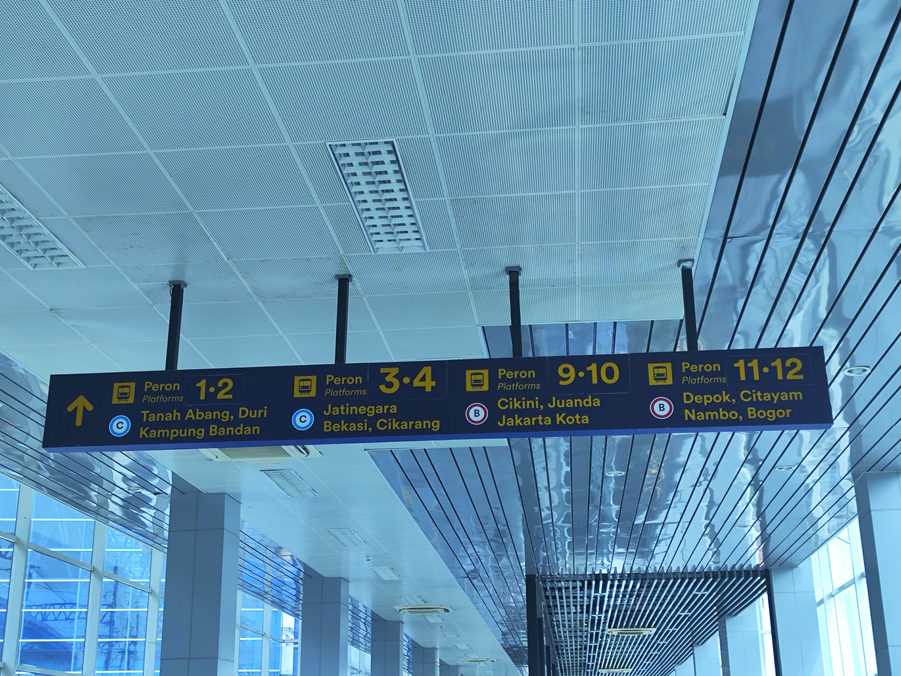
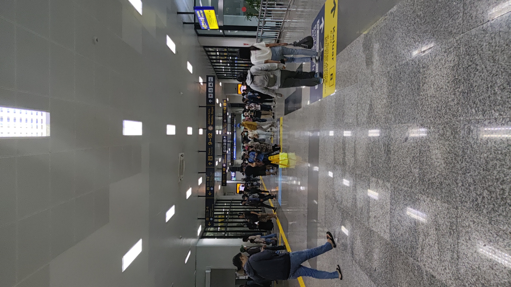

# Neuron needs his neurons fixed

## Owh first, a bit of announcement

For the sake of convenience, I compiled all of my video clips and some of my pics into one video. Uploading every individual video has so much unnecessary effort.

<Video src="https://youtu.be/cvogG-kOe6E?si=fnfqx0KI4fCNVhOq"></Video>

## Where am I?

*sigh...*
Let's be honest here...
The last semester of college tortures every single neuron (pun not intended) my brain has.
Everything that I did reminds me of this f-in thing.

I eat, oh sheez I need to revise my diagram
I sleep, NO I HAVE TO FIX THESE BUGS
I walk... was my thesis good enough for graduation?

...

...

...

**B-**, that was relieving.
Now the horror of defending my thesis is in my past. I need urgent therapy and that is into the unknown of Jakarta and its surroundings hehe. I can finally travel with no flashbacks or any horrible debuffs. I have an American level of freedom (well, at least till I submit my thesis's hardcover but nevermind)

## D-1
### Searching for a place

So, I have lots of places to visit on my Google Maps. I need to make sure that I can visit at least two landmark places for this day. There are so many options like PIK, Mall of Indonesia, Bogor, etc. However, most of the places there require a bike so I did not break my leg.

I still procrastinate myself so I do not have any kind of folding bicycle (yet) lol. Contact me if you are Jakartans and have any suggestions for me.

Anyway, I just remembered that I haven't visited Jakarta's state-owned zoo yet (Ragunan). It is accessible given their zoo is integrated well with their public transportation system. So, I marked that one.

Then, I scroll to the eastern side a bit and notice my mark. It is AEON Mall Tanjung Barat. Sure it is far enough from Ragunan yet they are also well integrated with Jakarta's transportation system.

I have no fear of distance as long as it is integrated enough with public transportation, so here goes nothing!

## 09:00

Ok, you know the drill. We always start at Tanjung Duren's bus stop.
From there, I will take the usual route to Gelora Bung Karno's bus stop. Now here is the trickier part. The route to Ragunan starts from Galunggung. This is not too far from my current position yet I need to transit twice. After I stop at Dukuh Atas's station, I proceed to Galunggung's station which is directly connected to the pedestrian bridge. From there, you can take any bus that has `6` in their code.

It is pretty much empty surprisingly. Not just one or two, but at the ENTIRE stop. I have a feeling that Jakartans either have no interest in Ragunan or simply they are getting bored quickly.
Whatever the reason is, I cannot cancel my trip, so I pull out my phone and take some lovely pictures. Take a look :)

<Transportation id="bus-1"/>

## 10:06
### 🐘 🫏

Welcome to Ragunan... bus stop for now.

After tapping out from the bus stop, I take a walk for 3 minutes to reach the North Gate (the nearest gate to the bus stop). Ticket counters are closed mostly due to a lack of visitors. There is only one still in service.

As for now, you can only enter using JakCard cards. Period. That card is provided by Bank DKI, a provincial bank that actively serves Jakarta province. So, if you only have Flazz like me, then I am sorry. I have to sack off my 75K IDR for a card + 20K IDR credits. Take note that a normal adult pass only costs 4K IDR per pax. 
Since this is also the only card I can use for other places like Monas, I decided to just take their offer generously and pull out my cold hard cash. That's right, this state-owned center of attraction in Jakarta even cannot accept QRIS or bank transfers :(

Now I am inside. The zoo is so empty that it looks like it is deserted. Sure, there are some visitors but for a center of attraction inside Jakarta, it is so underwhelming.

Ok, now I am here. I have to enjoy this otherwise I am wasting my money.

## 10:40
### I cannot skip brunch anymore

I find a small food court at the westernmost side of the zoo. I am getting paparazzi's treatment. It's like they are desperately trying to pull me in. I am hungry and their price tag seems reasonable. Therefore, I am trying it once.

As a fried rice enthusiast, I am trying to be positive about this fried rice, yet it is so hard. The rice was soggy, the crackers were soft as dough, the meatballs tasted weird and unappetizing, there was a hair on my food, and it was mushy, not what I expected from this rice.
Note that this is `Special Fried Rice` and there is no sausage even though they said there is 😞.

Chicken bits are ok and that's pretty much it.

<FoodReview id="warung_solo_barokah_27"/>

...

Yup, I am pretty much ok with my hunger bar, so I will continue my trip by taking a look around the zoo. Since there was so much footage around, I compiled the animals into a single video. Take a look tehe

Oh and my personal picks shall be displayed separately here

## 12:05 PM
### I need to leave fast. This next destination will take some time

Finding an exit is a nightmare if you are not used to walking for a long distance. I entered this place from the north gate and I had to take the same route for exit. It takes me 15 minutes due to the far distance (the zoo is huge I can admit) and only one north gate entrance is still in service as of now (they have multiple exits)

Eventually, I am out of the zoo. Cannot say I am impressed and cannot say I will come back but if you are interested in traveling here with me again my friends, I will consider tehe :)

I buy cold water for 5000K at the nearest convenience store because I believe drinking water inside a zoo will burn my wallet (as any shop inside attraction places should).

## 12:10 PM
### I am stupid but I am not smart :/

As much as knowledgeable about public transport in Jakarta, struggling with routes is still my main hurdle when traveling outside my commuting area.

If Transjakarta measures my tariffs through distance, I will lose my house instantly. For context, I need to find a train station that aligns with Bogor Commuter Line because my destination is on that line and Transjakarta Route 6 doesn't seem to be connected with any train station.

Recaps are available below this section but pay attention here still because this is going to get stupid.

After I took the bus into Patra Kuningan, I boarded this specially-numbered bus (L13E), thinking it might have a very special bus, but nope. It is just a regular bus
My supposed destination is Tegal Parang bus stop because it is connected to Line 9 which can take me to Cawang train station.

Due to my incompetence in my research (and also the inadequate markings on Transjakarta's website), I have no idea that Tegal Parang station is still on renovated. Realizing such a mistake, I quickly hop out onto the next stop after Tegal Parang, which is Tegal Mampang.

I am afraid that I have to force myself to use Uber due to my grave mistake.

...

Owh I don't need to... there's a bus line 6V that can take me into Mampang Prapatan, one of the bus stops that aligned itself with the usual line 6. I can do another retry.

So I hop onto that line and hop again into a 6B-labeled bus on Mampang Prapatan

... and I made another mistake... by taking the wrong route.. what the hell is wrong with me 😞...

...

...

Ok, another try. I take a detour using the 6A line, but this time, I will stop at Kuningan.
And what do we have here? Finally... a line directly connected with a station. Is it a good news? Well, there is good news and bad news.

This 4M-coded bus line will take me to Manggarai station. It is a central hub for Jakarta's commuter line. I never actually board a train from there so that's the good news.

<Transportation id="bus-2"/>

The bad news... It is so overcrowded at the weekend. Oh and please never go there on weekdays especially at the rush hour because I can tell you it is a terrifying experience. Workers even [resign from their workplace](https://kumparan.com/kumparannews/cerita-penumpang-krl-rela-resign-demi-hindari-transit-di-manggarai-1znKxN6SrzK) because they cannot exhaust themselves more after work by packing themselves like sardines in a can.

The reasons? People have to transit on here. Three commuter lines meet here and those lines have the most demand I can think of.

This problem gets worsened with the closing of the direct Bogor - Tanah Abang Line (so people are forced to transit inside Manggarai) and the government's initiative to transform Manggarai into a central station prematurely.

How bad is Manggarai as of now? Take a look

<Transportation id="train-1"/>

## 14:27 PM
### Manggarai is cool but it drains my phone juice

Welcome to Tanjung Barat

My next and final destination is AEON Tanjung Barat. I love this mall for its food buffet and unique atmosphere. It is the only AEON that is well-connected with public transportation so this will be my regular AEON location.

It only took me less than 5 minutes of walking and zebra crossing after tapping out of the station.

Finally... some cold air from the air conditioner. Just what I need after hours of being outside getting ab-sed by the sun.
I will not go into much detail when inside a mall because it is a typical middle-to-upper-class mall, yet I will share what's inside and what I buy

Let's start with this steak...
This steak is.. okay to say at least. It is Australian ribs (not my word) and I order medium-well-cooked ribs (in Indonesian terms, medium-well is medium-rare, and so on).

They give me a bit well-done steak which I am grateful for because I know how chewy the steaks are in middle-level restaurants if you order the usual medium-rare.

Not many comments. The veggies are too cold and the dressings are not to my liking. Mashed potatoes are a godsent present (yum, no chunky potatoes, just pure mashed potatoes). Mushroom sauces are ok and on par with common mushroom sauce

The meat is okay and it is enjoyable, but tastes like your usual steak cut from middle-class-restaurants.

<FoodReview id="karnivor"/>

It is still Ramadan month so non-muslims, quickly go into their Buffett as it is always overcrowded all day, especially at dinner/iftar time.

I ordered this chicken that is crispy and tasty hehe. The karaage and fried chicken are very affordable yet on par with any other great fried chicken I tasted before. Both the original and cheesy nori are worth trying.

Biryani rice is spicy and has so many herbs packed inside this tiny cup. I am a bit disappointed that it still has chicken bones inside the meat. I was hoping for boneless chicken to avoid any hassle while eating.

<FoodReview id="aeon"/>

Then, before Iftar, I buy this flavored milk drink on the upper floor. It is just plain milk mixed with vanilla powder yet it is strangely good.

<FoodReview id="susu_mbok_darmi_aeon"/>

## 18:36 PM
### Going home. Thanks for the trip hehe

Iftar had already commenced. Everyone already breaks their fast. It is time for me to get home and take a rest. As usual, I take a commuter line from Tanjung Barat to Juanda (no need to transit inside Manggarai hehe lucky me)

<Transportation id="train-2"/>

Not much going on other than another flavored-milk purchase after hopping out on Juanda's train station and on my way to Juanda bus stop. This time, it is green tea-flavored. It is ok compared to my previous purchase although it is much sweeter.

<Transportation id="bus-3"/>

<FoodReview id="susu_mbok_darmi_juanda"/>

## Fin

Ok, that's pretty much it. I have so much fun going out especially when I am stuck inside bus stops hehe.

I enjoyed walking out of my residence and taking public transportation. It drains my energy more than using a private vehicle, yet that's what I enjoy.

Hope you are enjoying yourself.
Thank you, stay safe, and stay public