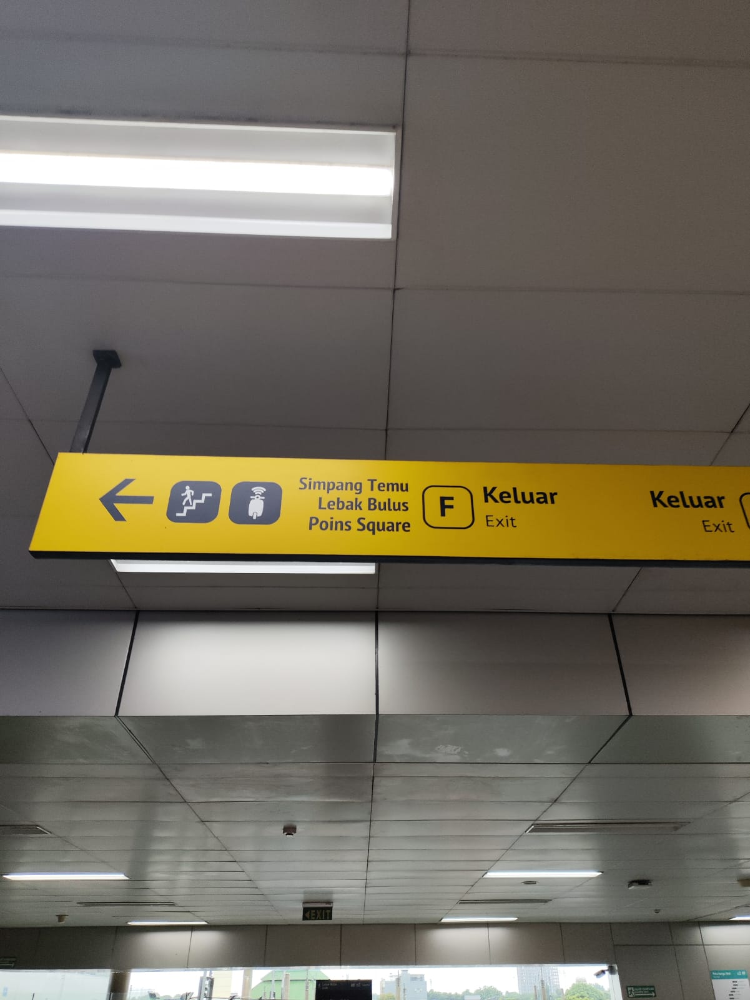
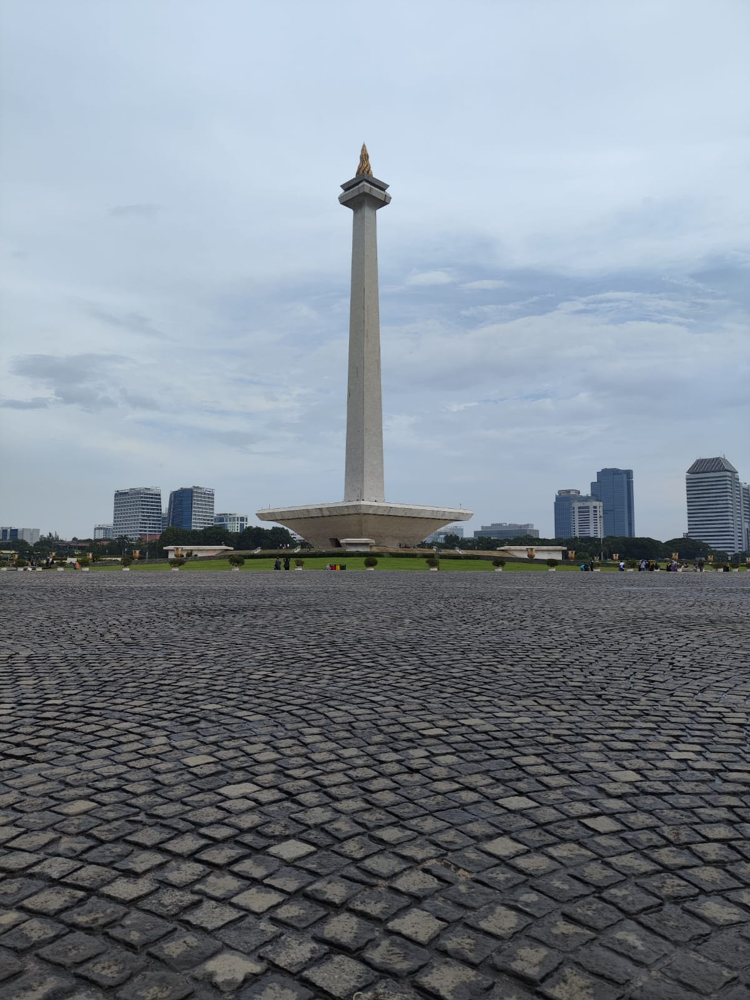

# My plan almost got knocked out tehe

Ok, welcome back. I hope I delivered my blog well last time.
So here is the thing... I already run out of ideas on where I should go for this day, so I decided to revisit some of the places and document them again here.

My itinerary was as follows:

- Go to Museum Nasional Indonesia and explore and learn about history
- Go to Monumen Nasional (Monas), take a picture, and go inside.
- Go to Masjid Istiqlal and Katedral Jakarta, take some pictures, and admire their beautiful architecture
- Go inside their Terowongan Silaturahmi (Friendship Tunnel) and admire their commitment to being united as Indonesians despite religious differences.
- Eat something. The budget is 150K

## 09:00

### Preparing my things

As usual, I only brought my phone, cap, filled water bottle, umbrella, and book in case I wanted to draw something.
Yup, it was raining... I did not expect this to happen yesterday, yet here I was. As a newbie tabibito, I could not let the rain lock me inside. I am a free boy and always be. So, I packed my things and walked outside with my umbrella.

First stop, Monas train station. The route using Transjakarta was significantly altered because of the massive MRT and revitalization project.
Here is a summary of what you can do. I live near `Tanjung Duren`

- You can take bus number 3F and drop yourself at `Gelora Bung Karno` station, then take number 1 and stop at `Monas`.
- You can also take number 8 which is heading to `Pasar Baru` station, but you **need to drop yourself off inside** `Pecenongan` station. From there, take number 2 to `Monas`

<Transportation id="bus-1"/>

## 09:45

### For f- sake???

Ok, I had to admit I did not do adequate research. The museum was still in renovation.

So for context, this National Museum was being ravaged by fire on 16th September, 2023. Coded-A building is the exact building that was being [engulfed in fire](https://www.instagram.com/p/CxQe-kxSTyY/). The museum was said to be closed at least till the end of 2023 when lots of scholars, historians, police, and others were working on identifying and [restoring affected artifacts](https://www.instagram.com/p/CyM_oaOSNBO/). So let us give them our support so it can be open to the public soon.

Ok back to myself, since it was raining and the museum was still closed, I have to craft another trip plan. It did not have to be good. It only needed to be ok so I did not stand with my brain empty.

After minutes of being empty inside Monas bus station, I craft my new plan as follows

- Go to `Blok M` station and try their pasta on cones.
- Go to the furthest station MRT can reach, which is `Lebak Bulus Grab`. Explore around a bit.
- If the rain has stopped, go back to `Monas` train station and go to the place I planned at the start of this blog.

That is a good plan I guess, so I set off from Monas train station and take number 1 to Blok M, the furthest station I can go

<Video src="../../images/2024/27-01/1-1.mp4" controls title="It is raining hard here tehe"></Video>

<Transportation id="bus-2"/>

## 10:25

### Welcome to Blok M. Enjoying my brunch

We reach the furthest point the number 1 bus can reach. It looks pretty old although it reached its glory years ago, but now I can see only their remains...

So after tapping out, I go inside their terminal. It was a soothing experience that I could see someone still open their food stall.

<Video src="../../images/2024/27-01/2-1.mp4" controls title="Around Blok M station"></Video>

I haven't had my breakfast so it would be a perfect chance to get one.

I found this clean and appetizing beef soto stand. The stall was surprisingly clean compared to the average food stand. I ordered a bowl of beef Soto and a place of rice. Since I brought my water from home, I did not see any purpose in ordering a drink.

Let's just say that this beef soto is not your average soto. It tastes refreshing. I could say they are not into exploding and wow type of taste. It was refreshing and can be enjoyed with calm and tranquility tehe. The meat was perfectly cooked and chewable. The risol was still crunchy and added a minor kick to the eating experience.

Oh did I mention that the rice is still warm? Adding to the fact that it was still raining heavily, this was the best meal I ever had. 25K? I would definitely come back and you should try this also.

<FoodReview id="warung_soto_asep"/>

## 10:35

### On my way to a park... for pasta

After my delicious brunch, I head to the exit. The exit I chose was the exit for MRT station. The surroundings were surreal. I could tell that this terminal already lost its glory several years ago. There was only one clothing retailer I met and so happy it could still stand. Here is a montage for you.

<Video src="../../images/2024/27-01/3-1.mp4" controls title="On my way out"></Video>
<Video src="../../images/2024/27-01/3-2.mp4" controls title="The remains of the legend"></Video>

I was out of the place! I grabbed my umbrella to protect myself. The next destination was just minutes away. The park did not have much going on but you would better believe that this park usually got crowded at the evening time.

After a bit of admiring, I went inside one of the pasta stores that serves your pasta inside a cone (no, not an ice cream cone). I ordered Penne Pollo Pesto because I never tasted Pesto paste before. Although there was only me in the waiting line, the cooking time took 5-10 minutes.

Meanwhile, have a look at their menu. All prices are tax-included.

I am waiting for the inventors to make a device that can record fragrance and smell. I kid you not, this was the best pasta I ever had, hands down. The pasta was aldente, the sauce was on a top tier.
Sure the chicken breast might be a bit dry, but that is why you have to eat it together with the pasta. It was a perfect combination.
As with your usual pasta, this amount of portion would keep you full for half a day.

<FoodReview id="pasta"/>

## 11:34

### I might already break my spending limit, but never mind, and show me the next location!

Pasta done, now to fill in my day, I took a walk to the nearest MRT station, called `Blok M BCA`. You could also use your prepaid card to pay for this service although the price depends on how long you will travel.

<Video src="../../images/2024/27-01/4-2.mp4" controls title="The station is upstairs"></Video>

After a security check on my belongings, I went up and waited for the rail train.
And sure enough, it arrived not long after.

<Video src="../../images/2024/27-01/4-3.mp4" controls title="There they are"></Video>

I could say the train looks so modern and polished. Thanks to whoever brought this kind of project to life.

My next stop: `Lebak Bulus Grab`
<Transportation id="mrt-1"/>

## 12:02

### Furthest destination:

The first time I stepped my foot on the furthest MRT station. Honestly, I had no plan on what I would do here until I saw a direction board that pointed to `Poins Mall`.

I thought this might be ok to visit since I could not find any interesting place here.

The track was elegant and modern. Everything looked polished and futuristic with a curved rooftop and minimalist design. I expected that the shopping mall would be as elegant as a mall in central Jakarta or its surroundings.

The entrance was unique and as soon as I was actually inside the mall, the true condition started to form. Looks like a hybrid between plaza and mall to be fair. I was at the 2nd or 3rd floor so I traveled all the way to the G floor because all journey starts from the bottom 😄

Here is a floor guide if you need one.

Not much to see aside from this beautiful dancing competition which I enjoyed watching for a while,

And a supermarket where I brought two bottles of water.

And also a toasted bread with butter and sugar because why not tehe.

<FoodReview id="hang_tuah"/>

And also a montage of my travel inside the mall

<Video src="../../images/2024/27-01/5-10.mp4" controls title="This escalator was reversed according to the sign there"></Video>

## 13:45

### The rain calmed a lot compared to before. Let us go back to the initial plan

Ok, enough for the mall critique. I took the same route to go back to `Lebak Bulus Grab` station and this time, I would take a route that goes from end-to-end and it costs 14K. Here is the detail:
<Transportation id="mrt-2"/>

Maybe you already started to wonder about those brand names embedded in the station. Well, there's a thing called `naming rights`. In lament terms, you can theoretically contact the management of MRT and buy a right to name your station. This is the alternative way for transportation companies to [generate revenue](https://www.fhwa.dot.gov/ipd/value_capture/defined/naming_rights.aspx). Sure, those companies are funded by your ticket and the government, however, it would be better to have a side revenue in case the government cuts the funding.

Ok back to my travel. To go to Monas, I had to walk to `Bundaran HI Astra` bus station and take a route using number 1 to `Monas` again. Here is the detail.
<Transportation id="bus-3"/>

## 14:37

### The only thing people knew about Jakarta's landmark

Well, the name of this bus station has an obvious reason behind the name. The walking distance from the bus station to actual Monas was not that far although you need to work out your feet more. The distance from the entrance gate to the point where you can see the monument clearly would hurt your feet a bit.

The wide area surrounding Monas would open till 16:00 so make sure you come here sooner.

The entrance was 40K for first time guests because you need to make a new prepaid card. I was tempted to enter their museum and went to the top, but the tickets had already sold out...

well... sorry but this destination will pop up again sometime in another blog :)...

## 15:07

### Largest mosque and a cathedral in Indonesia... unites under one country.

So.. next was a beautiful gothic-style cathedral and the largest mosque in Southeast Asia. The trip from Monas was not that far as it took me 8-10 minutes.

So here's the thing. Upon reaching the entrance gate, I felt uncomfortable asking or trying to go inside the mosque. Sure the official website said that the mosque is open to public... so I only took a picture outside. Maybe I need to bring a friend here.

For the cathedral, I was denied entry because I had a backpack on my back, which is prohibited inside. Well, too bad. At least I can now admire the church outside and enjoy its gothic-style beauty.

Also for the friendship tunnel I mentioned before, yeah forget about that...

## 15:25

### Searching for final meal before closing

Now I am hungry. Luckily my current location was near `Juanda` station which could take me directly to `Tanjung Duren` station. It would not hurt to walk around and find a decent meal for me right?

That was what I did. I searched around for food and I stumbled upon this road called "The Little India". Ok, this road looked very promising, so I went inside the vibes were a bit different from Jakarta's usual road, yet still looks the same.

There is not many interesting things to take a photo of, except for this "Little India Kitchen" restaurant. I rarely ate an Indian Meal, so I would give this a shot.

## 15:32

### Surreal...

First impression about this place, it lacks people. It was just me and a waiter in the main room. The interior was nice and the waiter was very kind to me, yet it felt so unnerving that no one came here.

I thought deep into my mind. Was that because the food was not okay? Was that because the services were horrible? I was gonna pick the former option as the valid answer, but I would wait until my orders were here.

My first order was Channai roti with curry sauce. The curry sauce was too salty and had too much MSG in taste, but ideally, you were not supposed to eat that without any compliments I guess. I dipped my roti into the curry. Oh wow, it tasted 10x better than before. The salty and savory somehow get nullified half of it with the channai roti which tasted like pure wheat. Perfect!

My second order was Vegetable Biryani rice. I need to be clear that this looks like fried rice with store-bought mix veggies. The smell was amazing but the taste was pretty much bland. I thought this needed to be eaten with curry also. Sure enough, it is. The curry from my Chanai order once again saved the dish from bad review.

So the food was okay-ish, but the food was not the answer to the lack of customers here. I checked Google Maps to look out their reviews and surprise surprise, this place WAS NOT indexed on Google Maps. And I just arrived at my answer. This place has so much potential. Try to mark your location and see what changed. Keep cookin!

<FoodReview id="little_india"/>

## 17:31

### Going back home, I guess

But before that, I need to take a ride back to my habitat. For that, I used my pal Tansjakarta again with the route as follows:

<Transportation id="bus-4"/>

I thought that I would go home straight, yet going inside Central Park for a while would not hurt me, right? Besides my 10% phone battery could sustain itself for some pics, right?

And oh lord I cannot imagine if I missed that. Just look at this Wushou Dance that I last saw 2-3 years ago. I miss that moment...

<Video src="../../images/2024/27-01/8-2.mp4" controls title="Wushou Dance tehe"></Video>

Also, this was written days before Genshin 4.4 update and that performance reminds me of Gaming, my ututu comfort boi UWAWAWAWAWA!!!

## Closing

### Thank you

And that was it. I hope you enjoy my trip. Until next time, Cyaaaaaaaaaaa :D.
