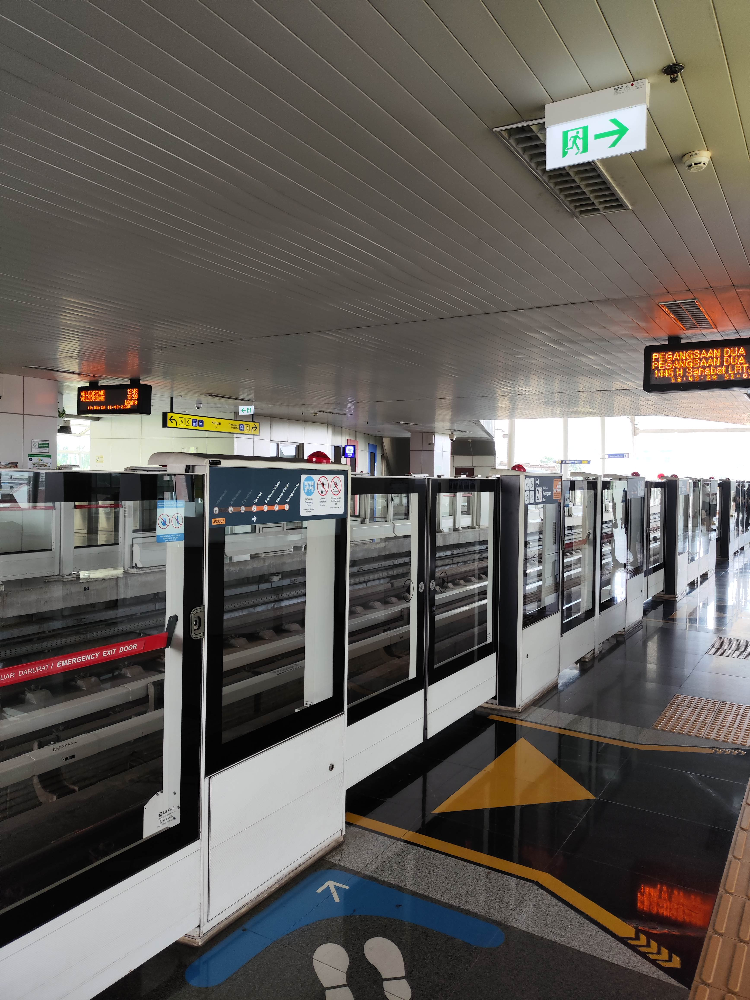
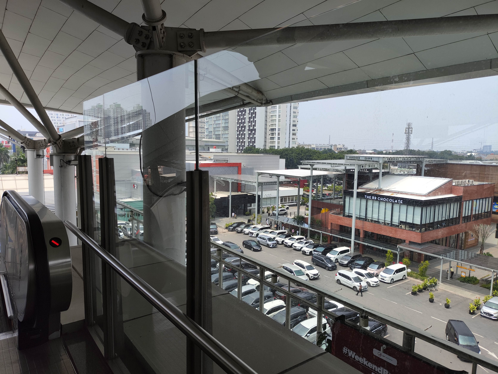

# LRT Jakarta for beginners

So, you have already learned a lot about Transjakarta? If not, you can read about that just by navigating using the sidebar 👈.

...

Ok, here we go. If you, as Jakartans, often stumble across the integration map of Jakarta, you might notice something on the upper-right side of the map. There is a small line that connects `Pegangsaan Dua` and `Velodrome` dots.

Well, that is gonna be the topic of this article, but first, some visuals hehe.

Enough for the visuals. Now time for you to read

So, LRT Jakarta is a light-rail transport system that is intended to accommodate the demand for public transportation in Jakarta. Instead of asphalt roads, they have railways. Instead of rubber wheels, they have steel wheels.

It is currently operational with more stops on construction. From my personal experience, it was a fun ride with chilling temperatures and cold seats because of the materials (metal).

Be wary that there is a different system called **LRT Jabodebek** or **Greater Jakarta LRT**. This is a completely different system with very different operators. I will make a separate writing about the latter system, so stay tuned hehe.

## History

History lesson, guys!

So, LRT Jakarta has been proposed since 2015 and it began its construction in June 2016. The purpose of this was to be the next-generation transportation system for the last 2018 Asian Games that was held in Jakarta (and Palembang).

But due to weather and the slow process of getting a greenlight from the transportation ministry, [it wasn't used for the public, unfortunately](https://www.cnbcindonesia.com/news/20180816124929-4-28934/gagalnya-lrt-jakarta-melayani-publik-di-asian-games-2018) 😞

After the 2018 Asian Games, there is still more to do like beta testing and finding another partner.

In the end, it welcomed its first real passenger on December 1st, 2019. On the same day, the tariffs were fixed at 5K IDR regardless of how long your trip is.

## Mechanics

From my live observation, this electric train uses a [third-line mechanism](https://adhi.co.id/pengaktifan-listrik-rel-lintasan-lrt-jabodebek/) to draw the power. In lament terms, there is a rail that is attached near the train track that is constantly electrified.

This kind of mechanism has its advantages. It looks much cleaner than using a cable on top, plus it is easier to maintain due to immunity against strong wind or birds although it will be another problem if there is flooding.

However, because it is attached to the train tracks, walking near the train tracks has a death wish. Adequate safety measures such as restricting access to train tracks [are necessary](https://www.railway-technology.com/features/overhead-lines-vs-third-rail-how-does-rail-electrification-work/?cf-view).

So is it better to use a cable on top? Well... it depends on the use case. But, I will not dive deeper into this kind of mechanism since I am not an engineer.

## Features

Rather than using words, I will let these images explain this to you

## Stops

Ok, so where can I ride this train?

As of now, there are a total of 6 operational stops and more are still in construction. Details of each stop are as follows:
* Pegangsaan DuaBoulevard Utara is Directly connected to Mall Kelapa Gading. Must go when in Jakarta. 
* Boulevard Selatan
* Pulomas
  5 minutes walk from Pulomas BRT stop.
* Equestrian
  Adjacent to Jakarta Equestrian Park
* Velodrome
  Adjacent to Jakarta International Velodrome

## How to ride

If you are a frequent user of Transjakarta or KRL Commuter, it has the same procedure. You go in, do a security check, tap your prepaid card, and enjoy.

Except... you can also pay for a ride using either JakLingko Apps or LinkAja apps. There was a single-paid card back then, but it was discontinued.

As explained before, the fare is fixed at a flat 5K IDR price. So, no matter how many stops you visit or how long your trip is, you cannot pay more or less than 5K IDR.

## Is this the perfect transportation for me

I cannot say yes to this case. It is still in infancy and doesn't have much stops. If you are going to Mall Kelapa Gading, then give it a try. It is also very limited in integration with another transportation mode, so consider giving it more time before using this as your daily commuter service.

## Final word

How is it? Are you tempted to give it a try?
Well, it is still new, but would it be nice to try this modern transportation system just for once?

If you have a plan to visit Mall Kelapa Gading or Velodrome, consider putting this on your map.

Now get off your seat and let's transit 😄

🚅🚅🚅